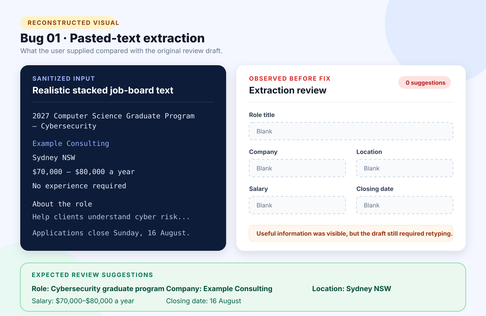

# Bug 01: Pasted-text importer misses realistic unlabelled job-board layouts

[← Back to the reported bugs index](../README.md)

| Status | Severity | Priority | Reported | Area |
| --- | --- | --- | --- | --- |
| Fixed | Medium | High | 24 August 2026 | Pasted-text importer |

## What happened

The importer understood tidy `Label: Value` examples but missed useful information in realistic job-board text where the title, employer, location, salary, and deadline appeared as stacked lines.

## How to reproduce

**Environment:** Chrome on Windows, local ASP.NET Core application, verified test account.

1. Open **Add application → Paste job text**.
2. Paste a realistic advertisement with an unlabelled stacked header.
3. Select **Extract and review**.
4. Inspect the suggested fields.

| Expected | Actual before the fix |
| --- | --- |
| Clearly supported values are suggested, while uncertain fields remain blank for review. | Most or all useful fields remain blank, forcing the user to retype information already present. |

## Visual



*Figure 1 — Reconstructed from a sanitized deterministic fixture. It illustrates the confirmed behaviour and is not presented as an original production screenshot.*

<details>
<summary>View the sanitized reproduction input</summary>

```text
2027 Computer Science Graduate Program - Cybersecurity
Example Consulting
Sydney NSW
$70,000 - $80,000 a year
No experience required
...
Applications close on Sunday, 16 August.
```

</details>

## Why it mattered

The failure defeated the purpose of assisted entry and added avoidable manual work. It was rated **Medium severity** because users could still continue by typing the data themselves, and **High priority** because the defect affected the importer’s primary workflow.

## Resolution and verification

- Added deterministic heuristics for stacked headers, Australian locations, common salary formats, platform phrases, and explicit closing-date sentences.
- Kept uncertain values blank instead of guessing.
- Preserved existing labelled extraction behaviour.
- Added synthetic SEEK-style and LinkedIn-style regression fixtures.
- Completed the formatting, Release build, automated test, and publish gate.
- The extractor remains rule-based and does not call an AI service.

## Traceability

- [Public GitHub issue #1](https://github.com/Chit-Thway/job-application-tracker-qa/issues/1)
- [Live Job Application Tracker](https://myjobtracker.com.au/)

This public report is sanitized and contains no credentials, private source code, personal job-search data, or complete third-party advertisements.
