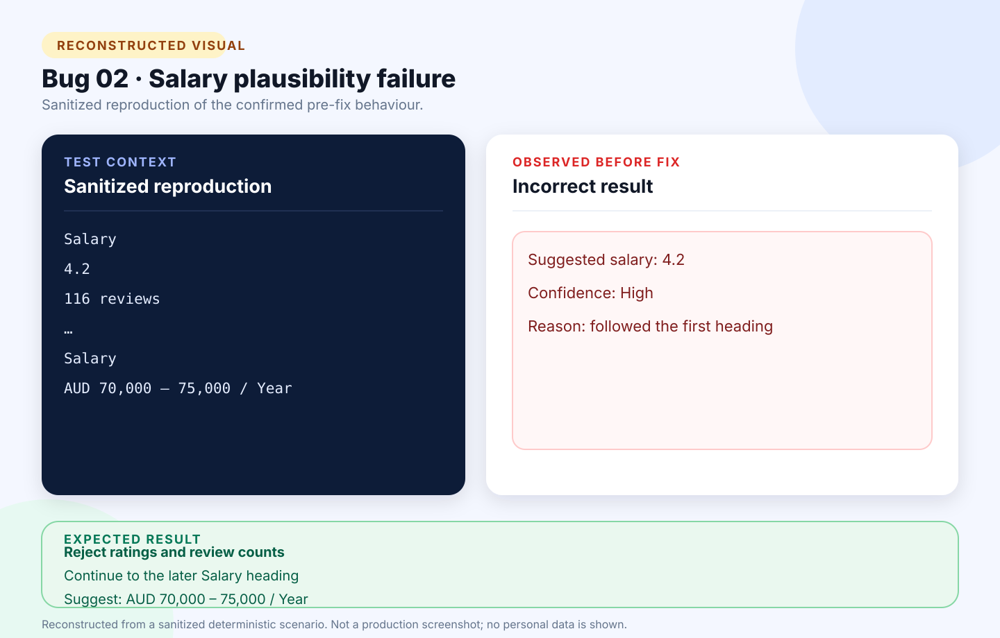

# Bug 02: Salary extractor uses employer rating instead of advertised pay range

[← Back to the reported bugs index](../README.md)

| Status | Severity | Priority | Reported | Area |
| --- | --- | --- | --- | --- |
| Fixed | Medium | High | 24 August 2026 | Salary extraction |

## What happened

A rating beneath an early Salary heading was accepted as compensation, even though the same advertisement later contained a genuine annual pay range.

## How to reproduce

**Environment:** Chrome on Windows; pasted graduate-program advertisement; verified test account.

1. Open **Add application → Paste job text**.
2. Paste an advertisement containing two Salary headings: the first followed by a rating and the second by a pay range.
3. Select **Extract and review**.
4. Inspect the suggested **Salary** value and its evidence.

| Expected | Actual before the fix |
| --- | --- |
| Reject the rating and review count, then suggest the later advertised pay range. | Suggested `4.2` as salary with high confidence. |

## Visual



*Reconstructed from a sanitized deterministic scenario. It illustrates the confirmed behaviour and is not presented as an original production screenshot.*

<details>
<summary>View the sanitized scenario shown in the visual</summary>

```text
Salary
4.2
116 reviews
…
Salary
AUD 70,000 – 75,000 / Year
```

</details>

## Why it mattered

Incorrect compensation could be saved and later used for misleading job comparisons.

**Assessment:** Medium severity because the draft remained editable; High priority because incorrect financial data looked trustworthy.

## Resolution and verification

- Added salary-specific plausibility checks.
- Rejected ratings, review counts, and vague text.
- Kept annual ranges, compact `70k–80k`, decimal hourly ranges, and daily or weekly rates valid.
- Added a duplicate-heading regression fixture and confirmed the advertised range in manual retesting.

## Traceability

- [Public GitHub issue #2](https://github.com/Chit-Thway/job-application-tracker-qa/issues/2)
- [Live Job Application Tracker](https://myjobtracker.com.au/)

This public report is sanitized and contains no credentials, private source code, personal job-search data, or complete third-party advertisements.
