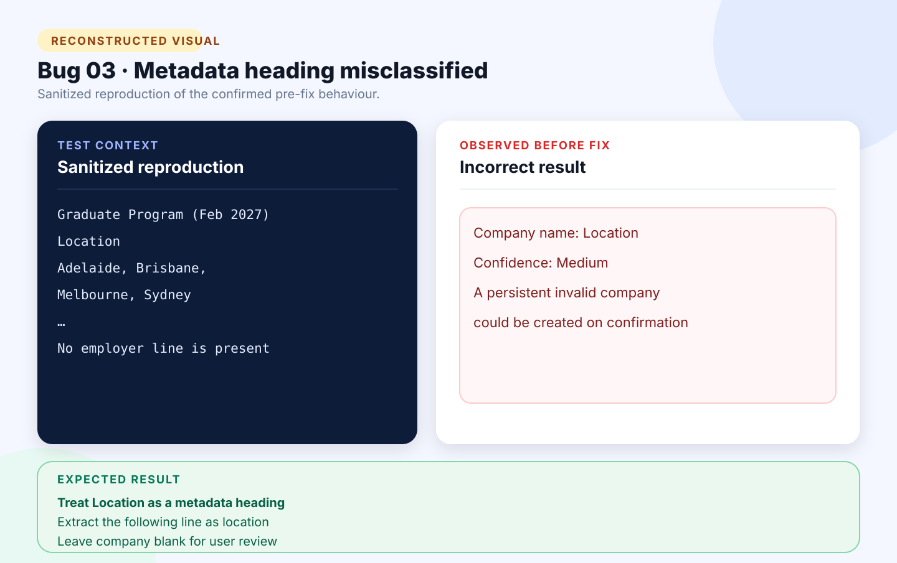

# Bug 03: Company extractor treats a Location heading as the company name

[← Back to the reported bugs index](../README.md)

| Status | Severity | Priority | Reported | Area |
| --- | --- | --- | --- | --- |
| Fixed | Medium | High | 24 August 2026 | Company extraction |

## What happened

When a posting omitted the employer line, the stacked-header heuristic treated the next metadata label—Location—as the company name.

## How to reproduce

**Environment:** Chrome on Windows; pasted-text workflow; verified test account.

1. Open **Add application → Paste job text**.
2. Paste a posting whose title is immediately followed by `Location` and an Australian location.
3. Select **Extract and review**.
4. Inspect **Company name**.

| Expected | Actual before the fix |
| --- | --- |
| Leave Company name blank because the source provides no reliable employer evidence. | Suggested `Location` as the company name. |

## Visual



*Reconstructed from a sanitized deterministic scenario. It illustrates the confirmed behaviour and is not presented as an original production screenshot.*

<details>
<summary>View the sanitized scenario shown in the visual</summary>

```text
Graduate Program (Feb 2027)
Location
Adelaide, Brisbane,
Melbourne, Sydney
…
No employer line is present
```

</details>

## Why it mattered

Confirming the draft could create a permanent company named Location and damage company-level history.

**Assessment:** Medium severity because the value was reviewable; High priority because confirmation created lasting bad data.

## Resolution and verification

- Excluded known metadata headings from company-name candidates.
- Covered Location, Salary, Work type, and related labels.
- Added regression tests for missing employers and confirmation safety.
- Confirmed valid stacked employer names still extract correctly.

## Traceability

- [Public GitHub issue #3](https://github.com/Chit-Thway/job-application-tracker-qa/issues/3)
- [Live Job Application Tracker](https://myjobtracker.com.au/)

This public report is sanitized and contains no credentials, private source code, personal job-search data, or complete third-party advertisements.
