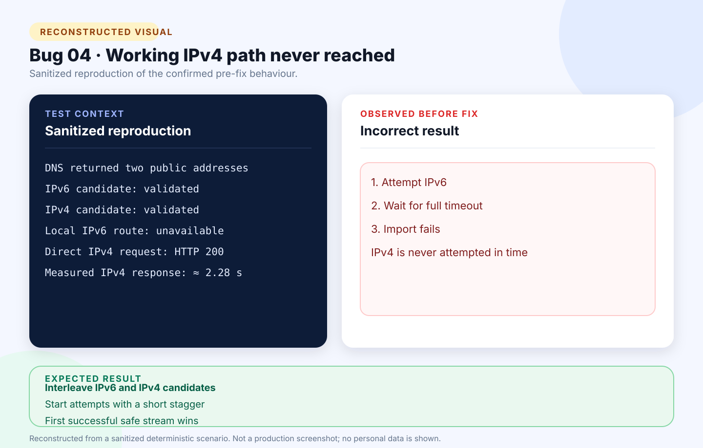

# Bug 04: URL import times out when IPv6 stalls before IPv4 fallback

[← Back to the reported bugs index](../README.md)

| Status | Severity | Priority | Reported | Area |
| --- | --- | --- | --- | --- |
| Fixed | Medium | High | 24 August 2026 | Networking / URL import |

## What happened

The importer tried validated network addresses sequentially, allowing an unreachable IPv6 route to consume the full timeout before a working IPv4 address could be attempted.

## How to reproduce

**Environment:** Windows; public HTTPS job page; host resolving to IPv6 and IPv4; unavailable local IPv6 route.

1. Open **Add application → Import public link**.
2. Submit a valid public job URL whose host resolves to IPv6 and IPv4.
3. Observe the importer timeout.
4. Request the same URL over IPv4 from the same machine.

| Expected | Actual before the fix |
| --- | --- |
| Reach the public site through the working address without allowing one stalled candidate to consume the operation timeout. | Timed out on IPv6 and never reached the working IPv4 candidate. |

## Visual



*Reconstructed from a sanitized deterministic scenario. It illustrates the confirmed behaviour and is not presented as an original production screenshot.*

<details>
<summary>View the sanitized scenario shown in the visual</summary>

```text
DNS returned two public addresses
IPv6 candidate: validated
IPv4 candidate: validated
Local IPv6 route: unavailable
Direct IPv4 request: HTTP 200
Measured IPv4 response: ≈ 2.28 s
```

</details>

## Why it mattered

Reachable job pages appeared unavailable and forced users back to manual entry.

**Assessment:** Medium severity because manual entry remained available; High priority because a core import path failed for valid URLs.

## Resolution and verification

- Interleaved already-validated IPv6 and IPv4 candidates.
- Introduced a 250 ms stagger and first-success connection strategy.
- Cancelled and disposed unfinished sockets.
- Preserved private, loopback, link-local, mixed-DNS, and SSRF protections.
- Passed the deterministic stalled-IPv6/working-IPv4 test and the full 92-test release gate.

## Traceability

- [Public GitHub issue #4](https://github.com/Chit-Thway/job-application-tracker-qa/issues/4)
- [Live Job Application Tracker](https://myjobtracker.com.au/)

This public report is sanitized and contains no credentials, private source code, personal job-search data, or complete third-party advertisements.
