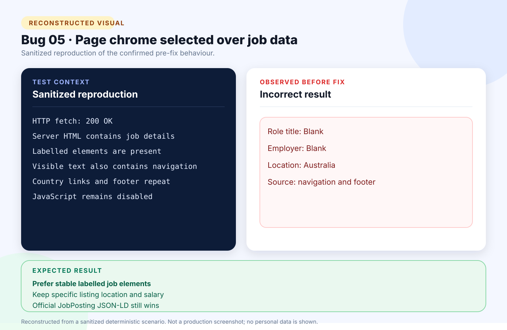

# Bug 05: SEEK URL import extracts page chrome instead of job details

[← Back to the reported bugs index](../README.md)

| Status | Severity | Priority | Reported | Area |
| --- | --- | --- | --- | --- |
| Fixed | Medium | High | 24 August 2026 | SEEK URL import |

## What happened

The network fetch succeeded, but generic visible-text extraction preferred shared navigation and footer content over the selected SEEK listing.

## How to reproduce

**Environment:** Chrome on Windows; accessible public SEEK listing; JavaScript execution disabled by design.

1. Open **Add application → Import public link**.
2. Submit a currently accessible SEEK job URL.
3. Wait for the review draft.
4. Inspect the role, employer, location, work type, salary, and fetched text.

| Expected | Actual before the fix |
| --- | --- |
| Read the selected listing’s labelled metadata from the server-returned HTML without executing scripts or making another request. | Returned blank role and employer, generic `Australia`, and source text dominated by site chrome. |

## Visual



*Reconstructed from a sanitized deterministic scenario. It illustrates the confirmed behaviour and is not presented as an original production screenshot.*

<details>
<summary>View the sanitized scenario shown in the visual</summary>

```text
HTTP fetch: 200 OK
Server HTML contains job details
Labelled elements are present
Visible text also contains navigation
Country links and footer repeat
JavaScript remains disabled
```

</details>

## Why it mattered

A successful-looking import produced an incomplete, misleading review draft.

**Assessment:** Medium severity because the user could repair the draft; High priority because URL import appeared successful while returning the wrong content.

## Resolution and verification

- Added extraction for stable labelled title, employer, location, work type, salary, classification, and description elements.
- Kept official Schema.org `JobPosting` JSON-LD at higher precedence.
- Added a deterministic SEEK-like HTML fixture.
- Confirmed no scripts execute and no second endpoint is contacted.
- Passed the zero-warning build, 94 automated tests, and Release publish gate.

## Traceability

- [Public GitHub issue #5](https://github.com/Chit-Thway/job-application-tracker-qa/issues/5)
- [Live Job Application Tracker](https://myjobtracker.com.au/)

This public report is sanitized and contains no credentials, private source code, personal job-search data, or complete third-party advertisements.
