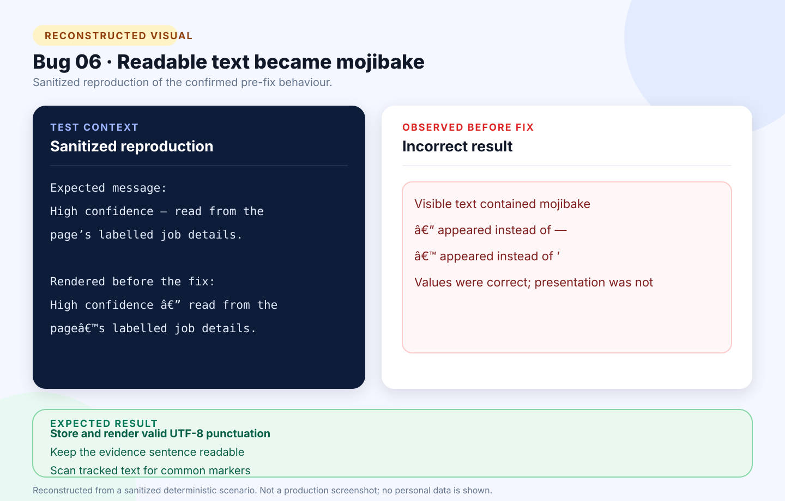

# Bug 06: Extraction evidence displays corrupted punctuation

[← Back to the reported bugs index](../README.md)

| Status | Severity | Priority | Reported | Area |
| --- | --- | --- | --- | --- |
| Fixed | Low | Medium | 24 August 2026 | Encoding / extraction UI |

## What happened

A human-readable extraction message contained mojibake sequences because punctuation had been stored as already-corrupted text.

## How to reproduce

**Environment:** Chrome on Windows; extraction review page; draft containing labelled fetched-page metadata.

1. Import a supported job advertisement.
2. Open the generated review draft.
3. Read the evidence sentence beneath an extracted field.
4. Compare the punctuation with ordinary UTF-8 text.

| Expected | Actual before the fix |
| --- | --- |
| Display readable punctuation such as an em dash and typographic apostrophe. | Displayed sequences such as `—` and `’`. |

## Visual



*Reconstructed from a sanitized deterministic scenario. It illustrates the confirmed behaviour and is not presented as an original production screenshot.*

<details>
<summary>View the sanitized scenario shown in the visual</summary>

```text
Expected message:
High confidence — read from the
page’s labelled job details.

Rendered before the fix:
High confidence — read from the
page’s labelled job details.
```

</details>

## Why it mattered

The extraction values were correct, but the broken message reduced readability and made the interface look unreliable.

**Assessment:** Low severity because no stored job data was corrupted; Medium priority because the defect was immediately visible in a review workflow.

## Resolution and verification

- Replaced the damaged tracked string with valid UTF-8 punctuation.
- Added an exact sentence assertion.
- Scanned tracked source for common mojibake markers.
- Preserved fetched-page extraction behaviour.
- Passed formatting, the zero-warning Release build, 94 automated tests, and Release publish.

## Traceability

- [Public GitHub issue #6](https://github.com/Chit-Thway/job-application-tracker-qa/issues/6)
- [Live Job Application Tracker](https://myjobtracker.com.au/)

This public report is sanitized and contains no credentials, private source code, personal job-search data, or complete third-party advertisements.
