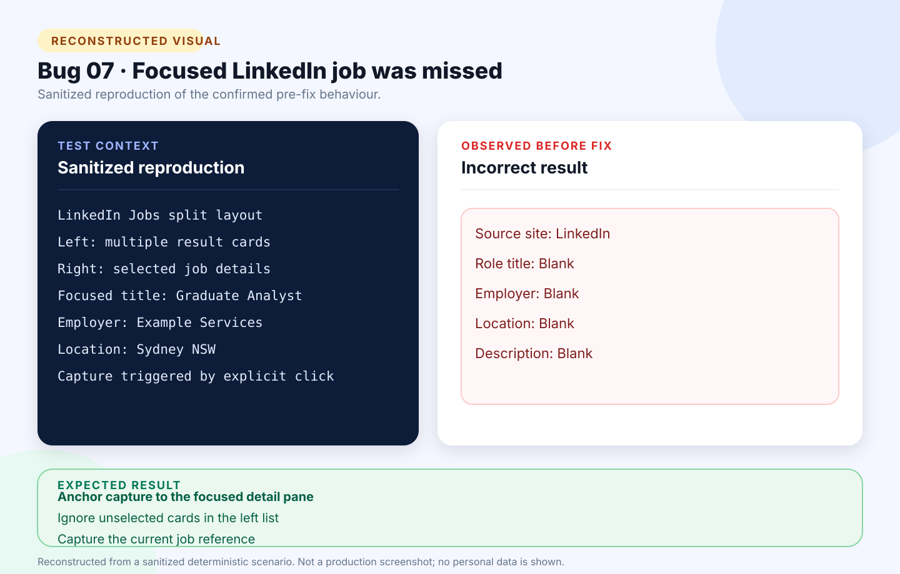

# Bug 07: Browser extension misses LinkedIn focused job details

[← Back to the reported bugs index](../README.md)

| Status | Severity | Priority | Reported | Area |
| --- | --- | --- | --- | --- |
| Fixed | Medium | High | 24 August 2026 | LinkedIn browser extension |

## What happened

On LinkedIn’s split job-search layout, generic page extraction missed the job displayed in the focused right-hand detail pane.

## How to reproduce

**Environment:** Chrome on Windows; signed-in LinkedIn Jobs search; explicit extension click and active-tab permission only.

1. Open a LinkedIn Jobs search-results page.
2. Select a job so its details appear in the right-hand pane.
3. Open the tracker extension and select **Capture and review**.
4. Compare the generated draft with the focused job.

| Expected | Actual before the fix |
| --- | --- |
| Capture the focused role, employer, location, work type, description, and current job reference without reading a different left-side result. | Captured only the source site while the important job fields remained blank. |

## Visual



*Reconstructed from a sanitized deterministic scenario. It illustrates the confirmed behaviour and is not presented as an original production screenshot.*

<details>
<summary>View the sanitized scenario shown in the visual</summary>

```text
LinkedIn Jobs split layout
Left: multiple result cards
Right: selected job details
Focused title: Graduate Analyst
Employer: Example Services
Location: Sydney NSW
Capture triggered by explicit click
```

</details>

## Why it mattered

LinkedIn users lost the one-click benefit and had to re-enter most of the selected job manually.

**Assessment:** Medium severity because manual entry remained possible; High priority because a major supported job board’s primary capture path failed.

## Resolution and verification

- Anchored extraction to LinkedIn’s focused job-detail container.
- Prevented unselected left-side cards from supplying title or employer.
- Added a deterministic LinkedIn-like fixture covering title, employer, location, work type, description, and reference.
- Preserved SEEK, Indeed, generic-page, Schema.org, and explicit-click permission behaviour.
- Passed the combined release gate with 104 unit tests, 96 integration tests, 3 browser journeys, JavaScript checks, and publish.

## Traceability

- [Public GitHub issue #7](https://github.com/Chit-Thway/job-application-tracker-qa/issues/7)
- [Live Job Application Tracker](https://myjobtracker.com.au/)

This public report is sanitized and contains no credentials, private source code, personal job-search data, or complete third-party advertisements.
