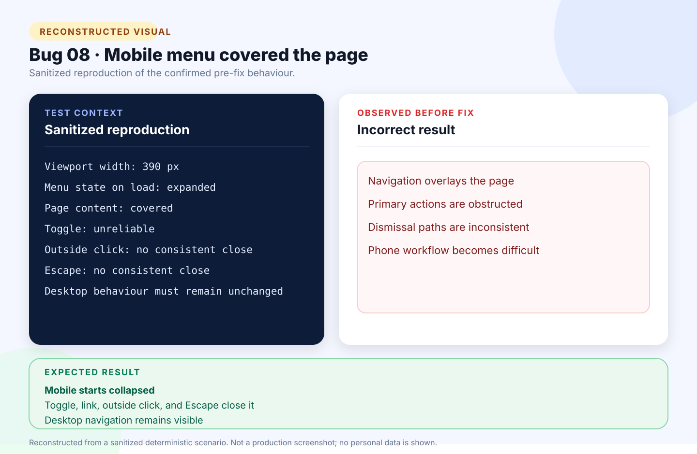

# Bug 08: Mobile navigation opens over content and cannot be dismissed reliably

[← Back to the reported bugs index](../README.md)

| Status | Severity | Priority | Reported | Area |
| --- | --- | --- | --- | --- |
| Fixed | High | High | 24 August 2026 | Responsive navigation |

## What happened

At a narrow viewport, the primary navigation loaded expanded over page content and did not have a reliable dismissal lifecycle.

## How to reproduce

**Environment:** Chrome responsive viewport at 390 px; authenticated layout and public synthetic demo.

1. Open the application at approximately 390 px wide.
2. Refresh an authenticated page or the public demo.
3. Observe the menu immediately after load.
4. Try the toggle, a navigation link, outside click, and Escape.

| Expected | Actual before the fix |
| --- | --- |
| Start collapsed on mobile, open from the Menu control, and close through the toggle, link selection, outside interaction, or Escape while desktop stays visible. | Started expanded over the content and could not be dismissed consistently. |

## Visual



*Reconstructed from a sanitized deterministic scenario. It illustrates the confirmed behaviour and is not presented as an original production screenshot.*

<details>
<summary>View the sanitized scenario shown in the visual</summary>

```text
Viewport width: 390 px
Menu state on load: expanded
Page content: covered
Toggle: unreliable
Outside click: no consistent close
Escape: no consistent close
Desktop behaviour must remain unchanged
```

</details>

## Why it mattered

The defect affected navigation across the product and could make core pages unusable on a phone.

**Assessment:** High severity and priority because it obstructed the entire mobile interface rather than one optional field.

## Resolution and verification

- Used a native checkbox-backed mobile control that starts collapsed without requiring JavaScript.
- Added progressive enhancement for link selection, outside interaction, Escape, and focus handling.
- Kept desktop navigation persistently visible and theme controls reachable.
- Covered authenticated and synthetic-demo layouts at 390 px.
- Passed 104 unit tests, 96 integration tests, 3 browser journeys, formatting, audit, JavaScript checks, and publish.

## Traceability

- [Public GitHub issue #8](https://github.com/Chit-Thway/job-application-tracker-qa/issues/8)
- [Live Job Application Tracker](https://myjobtracker.com.au/)

This public report is sanitized and contains no credentials, private source code, personal job-search data, or complete third-party advertisements.
