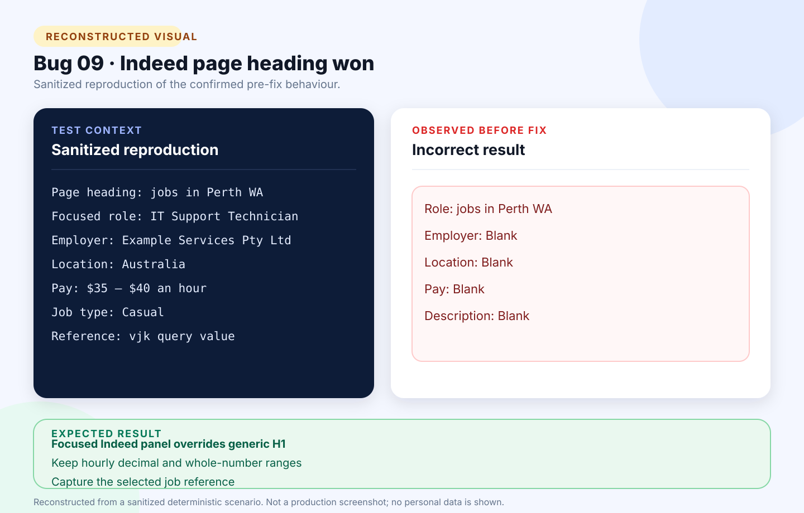

# Bug 09: Browser extension captures Indeed page heading instead of selected job

[← Back to the reported bugs index](../README.md)

| Status | Severity | Priority | Reported | Area |
| --- | --- | --- | --- | --- |
| Fixed | Medium | High | 24 August 2026 | Indeed browser extension |

## What happened

In Indeed’s split results layout, generic page-level selectors took precedence over the selected job panel and supplied an account greeting or search heading as the role.

## How to reproduce

**Environment:** Chrome on Windows; signed-in Indeed split results; explicit extension click and active-tab permission only.

1. Open an Indeed search-results page.
2. Select a job so its details appear in the focused panel.
3. Open the tracker extension and select **Capture and review**.
4. Compare the generated draft with the selected panel.

| Expected | Actual before the fix |
| --- | --- |
| Capture the selected role, employer, location, labelled hourly pay, job type, description, and job reference. | Used `Welcome, [user]` or `jobs in Perth WA` as the role and left the focused job fields blank. |

## Visual



*Reconstructed from a sanitized deterministic scenario. It illustrates the confirmed behaviour and is not presented as an original production screenshot.*

<details>
<summary>View the sanitized scenario shown in the visual</summary>

```text
Page heading: jobs in Perth WA
Focused role: IT Support Technician
Employer: Example Services Pty Ltd
Location: Australia
Pay: $35 – $40 an hour
Job type: Casual
Reference: vjk query value
```

</details>

## Why it mattered

The extension captured the wrong context and produced a draft requiring substantial correction.

**Assessment:** Medium severity because the draft was editable; High priority because the output looked plausible while referring to the wrong page element.

## Resolution and verification

- Gave Indeed’s selected-panel fields precedence over generic headings.
- Captured title, employer, location, labelled pay, job type, description, and `vjk` reference.
- Kept hourly, daily, weekly, decimal, and annual salary formats valid.
- Added regression checks blocking greeting and search headings.
- Passed 107 automated tests, JavaScript checks, the zero-warning Release build, and publish.

## Traceability

- [Public GitHub issue #9](https://github.com/Chit-Thway/job-application-tracker-qa/issues/9)
- [Live Job Application Tracker](https://myjobtracker.com.au/)

This public report is sanitized and contains no credentials, private source code, personal job-search data, or complete third-party advertisements.
