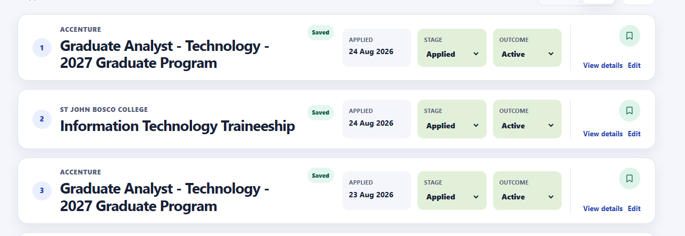
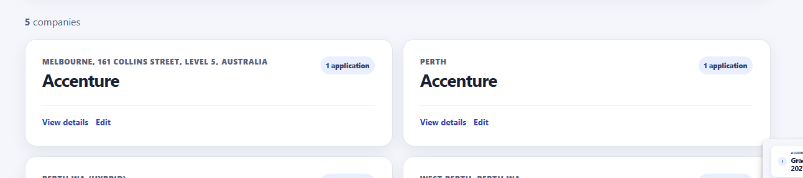

# Bug 10: Extraction review creates duplicate companies instead of offering an existing match

[← Back to the reported bugs index](../README.md)

| Status | Severity | Priority | Reported | Area |
| --- | --- | --- | --- | --- |
| Fixed | Medium | High | 24 August 2026 | Company matching |

## What happened

Confirming a second extracted application could create another company record for the same employer when its extracted location differed from the existing record.

## How to reproduce

**Environment:** Chrome on Windows; verified account; extracted-application review workflow.

1. Confirm an imported application for a company named `Accenture`.
2. Import a second Accenture role whose extracted location differs.
3. Confirm it without being offered the existing company.
4. Compare the **Applications** and **Companies** pages.

| Expected | Actual before the fix |
| --- | --- |
| Detect a credible owner-scoped name match and let the user explicitly reuse the existing company or create a separate one. Never merge automatically. | Both applications showed Accenture, but two company records were created and separated only by location. |

## Visuals

These are original sanitized screenshots captured during manual testing. Select either image to open it at full size.

<table>
<tr>
<td width="50%"></td>
<td width="50%"></td>
</tr>
<tr>
<td>Two saved applications show the same employer.</td>
<td>The Companies page contains two Accenture cards.</td>
</tr>
</table>

## Why it mattered

Duplicate company records fragmented application history, contacts, notes, and company context.

**Assessment:** Medium severity because applications remained usable; High priority because each new import could deepen persistent data duplication.

## Resolution and verification

- Added owner-scoped company-name comparison during extraction review.
- Suggested exact normalized and safe meaningful phrase matches.
- Required an explicit choice to reuse the existing company or create the extracted company.
- Never merged, renamed, or deleted companies automatically.
- Prevented matches against another owner’s data and weak substrings such as `Air` versus `Air Liquide`.
- Added deterministic coverage for both user choices, normalization, weak-match rejection, and owner isolation.

## Traceability

- [Public GitHub issue #10](https://github.com/Chit-Thway/job-application-tracker-qa/issues/10)
- [Live Job Application Tracker](https://myjobtracker.com.au/)

This public report is sanitized and contains no credentials, private source code, or personal job-search data.
